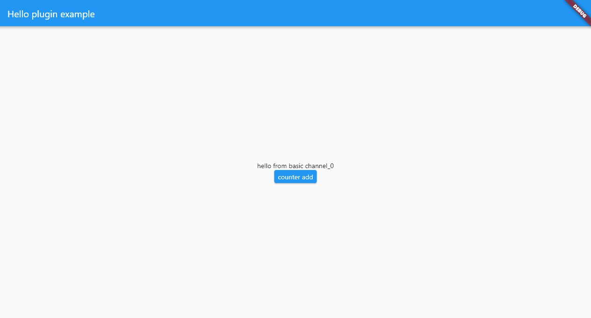

# BasicMessageChannel Test

A simple app to test the outcome of `BasicMessageChannel.send(null)` on Windows.

## Packages overview

Each package implements a component of the [federated plugins](https://flutter.dev/docs/development/packages-and-plugins/developing-packages#federated-plugins) architecture:

- app: flutter app that uses hello plugin, runner only created for Windows
- hello: app-facing package
- hello_platform_interface: platform interface package
- hello_platform_windows: platform package for Windows

## How to run

First, run `flutter config --enable-windows-desktop` to enable Flutter desktop support.

Then, in the app package, run `flutter run`. 

Click the "counter add" Button widget to test the app.
